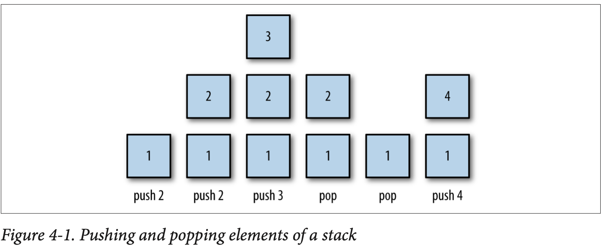

## 알고리즘
* 어떤 문제를 풀기 위한 절차나 방법
* 주어진 `입력`을 `출력`으로 만드는 과정
* 각 단계는 구체적이고 명료해야 한다.


연속된 합을 구하는 알고리즘
```javascript
function sum_n(n) { return n * (n + 1) / 2 }
console.log(sum_n(10)) // 55
console.log(sum_n(100)) // 5050
```


동명이인 찾는 알고리즘
```javascript
const name = ["Tom","Jerry","Mike","Tom", "Yun"]
let arr = []
const findName = (a) => {
    for (let i = 0; i < name.length -1; i++) {
        for (let j = i + 1; j < name.length; j++) {
            if (a[i] === a[j]) {
                arr.push(a[i])
            }
        }
    }
    return arr
}
console.log(findName(name))
```

 > 비교할 이름과 순서상의 다음 이름만 비교하면 된다. 자기 자신과 비교할 필요 없다. i = 0; j = i + 1;
 > 배열의 마지막 이름은 비교할 필요가 없다. 왜냐하면 자신의 뒤에 비교할 이름이 없고 비교가 끝났기 때문 i < name.length -1;

최대공약수 구하기
```javascript
function gcd(a,b) {
    let i = Math.min(a,b)
    while (true) {
        if (a % i === 0 && b % i === 0) {
            return i;
        }
        i = i -1;
    }
}
```
 > 최대공약수(Greatest Common Divisor, GCD) 두 개 이상의 정수의 공통 약수중에서 가장 큰 값
> 2개의 값 중 작은 값을 기준으로 소인수분해,
> a, b 값을 min 값으로 몫을 나누엇을 때 0이면 return
> 아니면  while i를 1 빼주면서 실행

 **또 다른 풀이 방법**
 * Euclid 방식 : `b` `a`를 `b`로 나눈 나머지의 최대공약수와 같다. 즉 gcd(a,b) = gcd(b, a % b);
 * 어떤 수와 0의 최대공약수는 자기 자신이다. 즉 gcd(n, 0) = n이다
   * gcd(60,24) = gcd(24, 60 % 24) = gcd(24, 12) = gcd(12, 24 % 12) = gcd(12, 0) = 12;
   * gcd(81, 27) = gcd(27, 81 % 27) = gcd(27, 0) = 27;

재귀함수 표현 
```javascript

const gcd = (a,b) => {
    if (b ===0) return a;

    return gcd(b, a%b)
}
console.log(gcd(60,24))
```
---


### **같은 이름을 찾는 알고리즘 복잡도가 O(n^2) 인 이유?**

비교해야 할 배열의 인덱스가 4인 경우에 
 * 0번 위치의 이름: n-1 (자기를 제외한 모든 이름과 비교)
 * 1번 위치의 이름: n-2번 비교
 * 2번 위치의 이름: n-3번 비교
 * n-2번 위치 이름: 1번 비교
 * n-1번 위치 이름: 0번 비교

결국, 전체 비교 횟수는 0 + 1 + 2 + 3 + 4 +... (n-1), 즉 1부터 n-1까지의 합
1부터 n까지의 합을 구하는 공식은 `n(n+1) / 2` 여기에 n을 n-1을 대입하면 `(n-1)(n-1+1) / 2` =  1/2n^ - 1/2n
n의 제곱에 비례해서 계산 시간이 변하는 것이 핵심이므로 n^2의 1/2계수는 무시하고 O(n^2)으로 표기

---

### Factorial
```javascript
const factrorial = (num) => {
    if ( num < 1) {
        return 1
    }
    return num * (factrorial(num - 1))
}
```
> factorial(4) 
>              -> 4 * factorial(3)
>                                  ->  3 * factorial(2)
>                                                       ->   2 * factorial(1)
>                                                                               ->  1 (n은 1이므로 종료조건)
>                                                       ->   2 * 1
>                                  -> 3 * 2 * 1
>              -> 4 * 3 * 2 * 1
> 
> 위 함수 호출을 4! 계산 수식으로 정리하면..
>   4!
>   = 4 * 3!
>   = 4 * 3 * 2!
>   = 4 * 3 * 2 * 1!
>   = 4 * 3 * 2 * 1 (1은 종료조건이므로 재귀 호출을 멈춤)
>   = 4 * 3 * 2
>   = 4 * 6
>   = 24

1부터 n까지의 합 구하기를 재귀 호출로 만들기
```javascript
let num = 0;
const fact = num => {
    if (num === 0)
        return 0

    return fact(num - 1) + num
}

console.log(fact(10))
```
----
## 시간복잡도
  * 표기 : `Big-O` 
  * 입력 값 변화에 따라 연산할 때 `연산횟수에 비해 걸리는 시간`
  
[예제]
  * O(1)
    + 입력값이 증가해도 시간이 늘어나지 않는 경우
    + 배열이 길이가 길어도 해당하는 인덱스에 접근하는 시간은 동일
  * O(n)
    + 입력값에 따라 시간이 같은 비율로 증가
    + 입력값이 1일때 1초의 시간이 걸리면, 입력 값이 100이면 100초의 시간 소요
  * O (log n)
    + 입력값에 따라 log n 만큼 시간이 증가하는 경우
  
### 버블정렬 (bubble sort)
  * O(n^2) 알고리즘은 n번의 라운드를 이루어져 있으며, 라운드 마다 배열 원소를 한번씩 쭉 살펴보다.
  * 순서가 잘못된 경우 Swap 한다.
  * `length - 1`인 이유는 n - 1 원소 정렬이 끝나면 마지막 원소는 이미 끝에 놓이기 때문이다.
```javascript
for (let i = 0; i < n.length -1; i++) {
  for (let j = 0; j < n.length -1; j++) {
    if (n[j] > n[j+1]) {
      let tmp = n[j + 1];
          n[j + 1] = n[j];
          n[j] = tmp;
```

 level 2. 버블정렬 개선 (bubble sort)
```javascript
const bubbleSort = (arr) => {
    let swapped = true;
    for (let i = 0; i < arr.length - 1; i++) {
        swapped = false;
        for (let j = 0; j < arr.length - 1; j++) {
            if (arr[j] > arr[j + 1]) {
                [arr[j], arr[j + 1]] = [arr[j + 1], arr[j]];
                swapped = true;
            }
        }
        if (!swapped) break;
    }
    return arr;
};
const a = [5, 2, 6, 3, 1, 4, 9, 8, 7];
console.log(bubbleSort(a));
```
#### 역위 (inversion)
  * 정렬 알고리즘 분석시 유용한 개념. 배열 인덱스 조합이 a < b 이지만 array[a] > array[b]인 경우 순서가 잘못되었을 때 이를 역위라 한다.
  * 즉 역위의 개수 = 필요한 작업량
  * 역위가 최대갯수인 경우의 식
```javascript
1 + 2 ...+ (n - 1) = n(n - 1) / 2 = O(n2);
```

### 병합정렬(merge sort)

* 병합정렬은 Linked List의 정렬이 필요할 때 유용.
* LinkedList는 삽입 및 삭제 연산에 유용, 접근 연산에 유용하지 않음. 
* 배열은 인덱스를 통해 접근하기 때문에 시간복잡도가 O(1)이지만, LinkedList는 Head 부터 탐색해야 하기 때문에 시간 복잡도가 O(n)이다.임의적인 접근에서는 오버헤드가 증가. 
* Linked List는 순차적인 접근과 같은 병합정렬을 사용하는 것이 유용.


> 출처 visualgo.net/sorting
-------
[Example 01]
```javascript
const merge = function (left, right) { // 정렬된 왼쪽과 오른쪽 배열을 받아서 하나로 합치는 순수한 함수
	const result = [];
	while (left.length !== 0 && right.length !== 0) {
		left[0] <= right[0] ? result.push(left.shift()) : result.push(right.shift());	
	}

	return [...result, ...left, ...right]; 
  // left,right 둘 중 하나는 요소가 남아있기 때문에 result 뒤에 붙여서 출력
}

const mergeSort = function (array) {
	// ending condition: length === 1 인 배열이 들어올 때, 정렬이 끝난 것. 
	if (array.length === 1) return array; //그 배열 그대로 리턴...! 정렬할 필요가 없으므로

	// 2로 나누고 '내림을' 해야
	// length 가 2일 때도 안전하게 배열을 slice 할 수 있다.
	const middleIndex = Math.floor(array.length / 2); 
	const left = array.slice(0, middleIndex);
	const right = array.slice(middleIndex);

	// 재귀로 계속해서 반으로 나누면서 length 가 1이 될때까지 쪼개고, 
	// 거꾸로 올라오면서 순수한 함수인 merge에 인자로 넣어서 다시 병합되어서 최종값을 리턴한다.
	return merge(mergeSort(left), mergeSort(right));
}
```
----------
[Example 02]
```javascript
var mergeSort = function (array) {
  if (array.length < 2) return array; // 원소가 하나일 때는 그대로 내보냅니다.
  var pivot = Math.floor(array.length / 2); // 대략 반으로 쪼개는 코드
  var left = array.slice(0, pivot); // 쪼갠 왼쪽
  var right = array.slice(pivot, array.length); // 쪼갠 오른쪽
  return merge(mergeSort(left), mergeSort(right)); // 재귀적으로 쪼개고 합칩니다.
};
function merge(left, right) {
  var result = [];
  console.log("-------------------------");
  left.forEach((e) => console.log("left" + e));
  right.forEach((e) => console.log("right" + e));
  while (left.length && right.length) {
    if (left[0] <= right[0]) {
      // 두 배열의 첫 원소를 비교하여
      result.push(left.shift()); // 더 작은 수를 결과에 넣어줍니다.
    } else {
      result.push(right.shift()); // 오른쪽도 마찬가지
    }
  }
  while (left.length) result.push(left.shift()); // 어느 한 배열이 더 많이 남았다면 나머지를 다 넣어줍니다.
  while (right.length) result.push(right.shift()); // 오른쪽도 마찬가지
  result.forEach((e) => console.log("result" + e));
  return result;
}

let answer = mergeSort([5, 2, 4, 7, 6, 1, 3, 8]); // [1, 2, 3, 4, 5, 6, 7, 8]

console.log(answer);

```

### 이분탐색 (Binary search) 
 탐색할 자료를 둘로 나누어 찾는 방법, 순차탐색보다 자료를 빠르게 찾을 수 있다.
 ```javascript
 let d = [1,4,9,16,25,36,49,64,81]
const binarySearch = (a, x) => {
    let start = 0;
    let end = a.length -1;

    while (start <= end) {
        let mid = Math.floor((start + end) / 2)
        if (x === a[mid]) {
            return mid
        } else if (x > a[mid]) {
            start = mid + 1
        } else {
            end = mid - 1
        }
    }
}
console.log(binarySearch(d, 64))
 ```
 > 이분 탐색을 가능하게 하려면 자료를 미리 정렬해야 한다.


 ---
## STACK
----
목록은 데이터의 자연스러운 형태입니다. List 클래스를 사용하여 데이터를 목록으로 구성하는 방법을 이미 보았습니다. 저장된 데이터의 순서가 중요하지 않거나 저장된 데이터를 검색할 필요가 없을 때 목록은 훌륭하게 작동합니다. 그러나 다른 응용 프로그램의 경우 일반 목록이 너무 단순하므로 더 복잡한 목록과 같은 데이터 구조가 필요합니다.
컴퓨팅의 많은 문제를 해결하는 데 사용할 수 있는 목록과 같은 구조는 스택입니다. 스택은 스택의 맨 위에서만 데이터를 추가하거나 제거할 수 있으므로 이러한 절차를 빠르고 쉽게 구현할 수 있으므로 스택은 효율적인 데이터 구조입니다. 스택은 표현식 평가에서 함수 호출 처리에 이르기까지 모든 것을 위한 프로그래밍 언어 구현에서 광범위하게 사용됩니다.

---
### Stack Operation
---
스택은 상단이라고 하는 목록의 한쪽 끝에서만 액세스할 수 있는 요소 목록입니다. 스택은 LIFO(후입선출) 데이터 구조로 알려져 있습니다.
스택의 후입선출 특성으로 인해 현재 스택의 맨 위에 있지 않은 요소는 액세스할 수 없습니다. 스택 맨 아래에 있는 요소에 도달하려면 먼저 스택 위에 있는 모든 요소를 ​​삭제해야 합니다.
스택의 두 가지 기본 작업은 스택에 요소를 추가하고 스택에서 요소를 제거하는 것입니다. 요소는 푸시 작업을 사용하여 스택에 추가됩니다. 요소는 팝 작업을 사용하여 스택에서 제거됩니다. 이러한 작업은 그림 4-1에 설명되어 있습니다.



스택에 대한 또 다른 일반적인 작업은 스택 맨 위에 있는 요소를 보는 것입니다. `pop` 작업은 스택의 맨 위 요소를 방문하지만 `stack`에서 요소를 영구적으로 제거합니다. `peek` 작업은 스택에서 제거하지 않고 스택의 맨 위에 저장된 값을 반환합니다.
최상위 요소의 위치를 ​​추적하고 새 요소를 추가할 위치를 추적하기 위해 스택에 새 요소를 푸시할 때 증가하고 스택에서 요소를 팝할 때 감소하는 최상위 변수를 사용합니다.
`push`, `pop` 및 `peek` 스택과 관련된 기본 작업이지만 수행해야 하는 다른 작업과 검사해야 하는 속성이 있습니다. 지우기 작업은 스택에서 모든 요소를 ​​제거합니다. `length 속성`은 스택에 포함된 요소의 수를 보유합니다. 또한 스택에 요소가 없는지 알려주기 위해 빈 속성을 정의하지만 이에 대해서도 `length 속성`을 사용할 수 있습니다


---
### A Stack Implementation
---
스택을 구축하려면 먼저 스택 요소를 저장하는 데 사용할 기본 데이터 구조를 결정해야 합니다. 우리는 구현에서 배열을 사용할 것입니다.
Stack 클래스에 대한 생성자 함수를 정의하여 스택 구현을 시작합니다.

```javascript
function Stack() { 
    this.dataStore = []; 
    this.top = 0; 
    this.push = push; 
    this.pop = pop; 
    this.peek = peek;
}
```
스택 요소를 저장하는 배열의 이름은 `dataStore`입니다. 생성자는 이를 빈 배열로 설정합니다. top 변수는 스택의 맨 위를 추적하고 생성자에 의해 처음에 0으로 설정됩니다. 이는 적어도 요소가 스택에 푸시될 때까지 배열의 0 위치가 스택의 맨 위임을 나타냅니다.
구현할 첫 번째 함수는 `push()` 함수입니다. 새 요소를 스택에 푸시할 때, 우리는 그것을 최상단 위치에 저장하고 새로운 상단이 배열의 다음 빈 위치가 되도록 상단 변수를 증가시켜야 합니다. 코드는 다음과 같습니다.

```javascript
function push(element) { 
    this.dataStore[this.top++] = element; }
```

this.top 호출 후 증가 연산자의 배치에 특히 주의하십시오. 연산자를 거기에 배치하면 top이 증가하기 전에 스택의 맨 위에 새 요소를 배치하는 데 top의 현재 값이 사용됩니다.
`pop()` 함수는 `push()` 함수의 역순으로 수행합니다. 스택의 맨 위 위치에 있는 요소를 반환한 다음 맨 위 변수를 감소시킵니다.

```javascript

function pop() { return this.dataStore[--this.top]; }

```
`peek() 함수`는 배열의 top-1 위치에 있는 요소에 액세스하여 스택의 최상위 요소를 반환합니다.

```javascript
function peek() { return this.dataStore[this.top-1]; }
```
빈 스택에서 `peek()` 함수를 호출하면 결과로 정의되지 않습니다. 스택이 비어 있기 때문에 맨 위에 있는 값이 저장되어 있지 않기 때문입니다.
스택에 얼마나 많은 요소가 저장되어 있는지 알아야 하는 상황이 있습니다. `length()` 함수는 top 값을 반환하여 이 값을 반환합니다.

```javascript
function length() { return this.top; }
```
마지막으로 최상위 변수를 다시 0으로 설정하여 스택을 지울 수 있습니다.
```javascript
function clear() { this.top = 0; }
```

**[Example Recap code]**
```javascript

function Stack() { 
    this.dataStore = [];
    this.top = 0; 
    this.push = push; 
    this.pop = pop; 
    this.peek = peek; 
    this.clear = clear; 
    this.length = length;
}
function push(element) { 
    this.dataStore[this.top++] = element; }
function peek() { return this.dataStore[this.top-1]; }
function pop() { return this.dataStore[--this.top]; }
function clear() { this.top = 0; }
function length() { return this.top; }
```

**[Example Test Code]**
```javascript
var s = new Stack(); 
    s.push("David"); 
    s.push("Raymond"); 
    s.push("Bryan"); 
    print("length: " + s.length()); 
    print(s.peek());
var popped = s.pop();
    print("The popped element is: " + popped); 
    print(s.peek());
    s.push("Cynthia");
    print(s.peek());
    s.clear();
    print("length: " + s.length()); print(s.peek());
    s.push("Clayton");
    print(s.peek());
```

스택이 지워지면 맨 위 위치에 값이 없고 스택 맨 위에서 엿볼 때 `undefined`가 반환되기 때문에 마지막에서 다음 값인 `undefined`가 반환됩니다.

[ES6 ver]
```javascript
let dataStore = [];
let top = 0;
const push = (element) => (dataStore[top++] = element);
const peek = () => dataStore[top - 1];
const pop = () => dataStore[--top];
const clear = () => (top = 0);
const length = () => top;

push("David");
push("Raymond");
push("Bryan");
console.log(length());
console.log(peek());
let popped = pop();
console.log(popped);
console.log(peek());
push("Cynthia"); 
console.log(peek());
clear();
console.log(length());
console.log(peek());
push("Clayton");
console.log(peek());
```

### Using the Stack Class

```javascript
const mulBase = (num, base) => {
  let arr = [];
  do {
    arr.push(num % base);
    num = Math.floor((num /= base));
  } while (num > 0);
  let converted = "";
  while (arr.length > 0) {
    converted += arr.pop();
  }
  return converted;
};

let num = 32;
let base = 2;
let newNumber = mulBase(num, base);
console.log(`${num} converted to base ${base} is ${newNumber}`);
```